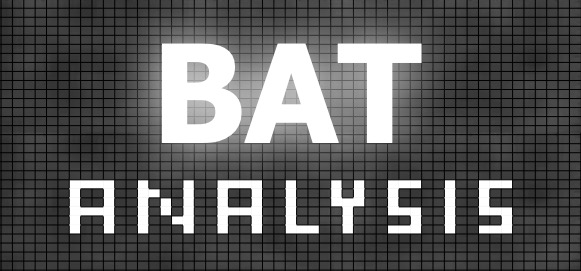

<!--
*** Thanks for checking out the Best-README-Template. If you have a suggestion
*** that would make this better, please fork the repo and create a pull request
*** or simply open an issue with the tag "enhancement".
*** Thanks again! Now go create something AMAZING! :D
***
***
***
*** To avoid retyping too much info. Do a search and replace for the following:
*** lazzati-astro, MCRaT, twitter_handle, email, project_title, project_description


steps to upload a distribution to PyPi is at: https://stackoverflow.com/questions/1471994/what-is-setup-py
-->


<!-- PROJECT SHIELDS -->
<!--
*** I'm using markdown "reference style" links for readability.
*** Reference links are enclosed in brackets [ ] instead of parentheses ( ).
*** See the bottom of this document for the declaration of the reference variables
*** for contributors-url, forks-url, etc. This is an optional, concise syntax you may use.
*** https://www.markdownguide.org/basic-syntax/#reference-style-links
-->
[![Contributors][contributors-shield]][contributors-url]
[![Forks][forks-shield]][forks-url]
[![Stargazers][stars-shield]][stars-url]
[![Issues][issues-shield]][issues-url]
[![MIT License][license-shield]][license-url]  
[](https://scholar.google.com/citations?user=cIxaj3MAAAAJ&hl=en)
[](https://www.researchgate.net/profile/Tyler-Parsotan)
[](https://doi.org/10.5281/zenodo.7916509)
<a href="https://ascl.net/2304.003"></a>

<!-- PROJECT LOGO -->
<br />
<p align="center">
  <a href="https://github.com/parsotat/BatAnalysis">
    
  </a>

  <h3 align="center">The BatAnalysis Pipeline </h3>

  <p align="center">
    The BatAnalysis python pipeline is brings the analysis of BAT data to the convenience offered by Python. 
    <br />
    <a href="https://github.com/parsotat/BatAnalysis/tree/master/Doc"><strong>Explore the docs »</strong></a>
    <br />
    <br />
    <!-- <a href="https://github.com/parsotat/BatAnalysis">View Demo</a>
    · -->
    <a href="https://github.com/parsotat/BatAnalysis/issues">Report Bug</a>
    ·
    <a href="https://github.com/parsotat/BatAnalysis/issues">Request Feature</a>
  </p>
</p>


<!-- TABLE OF CONTENTS -->
<details open="open">
  <summary><h2 style="display: inline-block">Table of Contents</h2></summary>
  <ol>
    <li>
      <a href="#about-the-project">About The Project</a>
      <ul>
        <li><a href="#built-with">Built With</a></li>
      </ul>
    </li>
    <li>
      <a href="#getting-started">Getting Started</a>
      <ul>
        <li><a href="#prerequisites">Prerequisites</a></li>
        <li><a href="#installation">Installation</a></li>
      </ul>
    </li>
    <li><a href="#usage">Usage</a></li>
    <li><a href="#roadmap">Roadmap</a></li>
    <li><a href="#contributing">Contributing</a></li>
    <li><a href="#license">License</a></li>
    <li><a href="#contact">Contact</a></li>
    <li><a href="#acknowledgements">Acknowledgements</a></li>
  </ol>
</details>


<!-- ABOUT THE PROJECT -->
## About The Project

<!-- [![Product Name Screen Shot][product-screenshot]](https://example.com) -->

BatAnalysis is a python package that allows for the convenient analysis of BAT Survey and Time-tagged Event (TTE) data. 
This code allows users to: 
* easily download BAT data, 
* batch process the observations,
* extract light curves and spectra for each  observation for a given source

For survey data in particular it allows users to:
* create mosaiced images at different time bins, and
* extract light curves and spectra from the mosaiced images for a given source. 

This project was developed in collaboration with the members of the BAT Team including:
David Palmer, Sibasish Laha, Amy Lien, and Craig Markwardt.

### Built With

* [Python 3](https://www.anaconda.com/products/distribution)
* [HEASoftPy](https://heasarc.gsfc.nasa.gov/lheasoft/heasoftpy/)
* [PyXspec](https://heasarc.gsfc.nasa.gov/xanadu/xspec/python/html/index.html)
* [swiftbat_python](https://github.com/lanl/swiftbat_python)
* [Swifttools](https://gitlab.com/DrPhilEvans/swifttools)
* typical python modules ([astropy](https://www.astropy.org), [numpy](https://numpy.org), [scipy](https://scipy.org), etc.)

<!-- GETTING STARTED -->
## Getting Started

It is easy to get started on your local computer or on [SciServer](https://heasarc.gsfc.nasa.gov/docs/sciserver/#getting-started)

### Prerequisites

The following software are necessary for the BatAnalysis python module. 

1. Python 3.9 or greater
    - We recommend installing via Anaconda
2. swiftbat_python 
   - This will be installed via the pip command below
3. Swifttools
   - This will also installed via the pip command below
4. HEASoftPy >= v1.4.1 (HEASoft >= v6.33.2)
   - The installation is included with HEASoft and the steps can be found here: [https://heasarc.gsfc.nasa.gov/lheasoft/install.html](https://heasarc.gsfc.nasa.gov/lheasoft/install.html)
5. PyXspec
   - The installation is included with HEASoft but there may be additional steps to take if you have changed your anaconda 
version after building HEASoft. More information can be found here: [https://heasarc.gsfc.nasa.gov/xanadu/xspec/python/html/buildinstall.html](https://heasarc.gsfc.nasa.gov/xanadu/xspec/python/html/buildinstall.html)
6. Swift BAT Pattern Noise Maps (necessary for the analysis of survey data)
   - The pattern maps used by the BAT team are available on [zenodo](https://zenodo.org/record/7595904#.Y9q7pS-B3T8) for download. 
   These maps shoud be downloaded and placed into a place where the BatAnalysis code will be able to access them. 
        - _This data is most easily downloaded using the [zenodo_get](https://github.com/dvolgyes/zenodo_get) utility, especially for installation on remote servers_

Using the SciServer interface it is easier to start using BatAnalysis since HEASoftpy and pyXspec are already installed. 

### Getting Started on SciServer
1. To get started on Sciserver, first follow the instructions outlined [here](https://heasarc.gsfc.nasa.gov/docs/sciserver/#getting-started)
to get an account set up and get a container up and running. 

***Be sure that the container that is created has a compatible python and HEASoft version***

2. With the container created, the user can install BatAnalysis through pip:
```sh
    pip install BatAnalysis
  ```
3. The Pattern Noise Maps can easily be downloaded into the `/home/idies/workspace/Temporary/<username>/scratch/` directory with the use of the 
[zenodo_get](https://github.com/dvolgyes/zenodo_get) utility. If the analyses that will be conducted will not involve survey data being mosaiced then this step can be skipped.

### Getting Started on a Local Computer
To get up and running on a local computer once the prerequisites met is very simple. 
All that is needed to install the package is either:

A. Pip install the BatAnalysis package:
```sh
    pip install BatAnalysis
  ```
    

B. Clone the repo and install 
   ```sh
   git clone https://github.com/parsotat/BatAnalysis.git
   cd BatAnalysis/
   pip install -e .
   ```


<!-- USAGE EXAMPLES -->
## Usage

### a) Survey Data

The typical BatAnalysis workflow for analyzing survey data is as follows:

1. Use astroquery to queue HEASARC for obervations within a given date range for an RA/DEC coordinate corresponding to a source of interest
2. Download the data 
3. Run batsurvey on each observation ID
4. Calculate the detector response matrix for each survey pointing
5. Calculate the spectrum in each pointing
6. Fit the spectra to obtain spectral information
6. Calculate the light curve for the time period of interest
7. Plot the light curve/spectral information
8. Create mosaiced images for the time binning of interest (days, weeks, months, years)
9. Create the total "time-integrated" mosaiced image
10. Extract the spectra of the mosaiced images and fit them
11. Calculate the light curve of the source from the mosaiced images
12. Plot the light curve/spectral information for the mosaiced images

Following these steps for the first 5 survey observation IDs for the Crab (although see the notebooks directory for recommended analysis steps):
```sh
import batanalysis as ba
import swiftbat
import numpy as np 
import matplotlib.pyplot as plt
from pathlib import Path
plt.ion()

object_name='Crab'
catalog_name="Crab_Nebula_Pulsar"
table = ba.from_heasarc(object_name)
result = ba.download_swiftdata(table[:5])

batsurvey_obs=ba.parallel.batsurvey_analysis(table["OBSID"][:5], nprocs=2)

#the name of the source in the included survey catalog must be used here 
noise_map_dir=Path("/path/to/downloaded/PATTERN_MAPS/")
batsurvey_obs=ba.parallel.batspectrum_analysis(batsurvey_obs, catalog_name, patt_noise_dir=noise_map_dir, nprocs=2)

ba.plot_survey_lc(batsurvey_obs, id_list=catalog_name, calc_lc=True)

outventory_file=ba.merge_outventory(batsurvey_obs)

#bin into 1 month time bins
time_bins=ba.group_outventory(outventory_file, np.timedelta64(1,'M'))

#bin into daily time bin
mosaic_list, total_mosaic=ba.parallel.batmosaic_analysis(batsurvey_obs, outventory_file, time_bins, nprocs=3)

mosaic_list=ba.parallel.batspectrum_analysis(mosaic_list, catalog_name, nprocs=2)

ba.plot_survey_lc(mosaic_list, id_list=catalog_name, calc_lc=True)

```

### b) TTE Data

The typical BatAnalysis workflow for analyzing TTE data is as follows:

1. Query TTE data based on different criteria
2. Download the data 
3. Load the data with BatEvent
4. Calculate sky images with the data to identify a source
5. Mask-weight the data based on the source of interest
4. Calculate lightcurves arbitarily binned in time and energy with the mask-weighted data
5. Calculate spectra and the detector response matrices for a given time interval
6. Fit the spectra to obtain spectral information
7. Plot the light curve/spectral information


_For more details and additional examples please refer to the [Notebooks](https://github.com/parsotat/BatAnalysis/tree/main/notebooks) directory_


<!-- ROADMAP -->
## Roadmap

Next, this package will be modified to include analysis of BAT scaled map data. 

See the [open issues](https://github.com/parsotat/BatAnalysis/issues) for a list of proposed features (and known issues).


<!-- CONTRIBUTING -->
## Contributing

Contributions are what make the open source community such an amazing place to learn, inspire, and create. Any contributions you make are **greatly appreciated**.

1. Fork the Project
2. Create your Feature Branch (`git checkout -b feature/AmazingFeature`)
3. Commit your Changes (`git commit -m 'Add some AmazingFeature'`)
4. Push to the Branch (`git push origin feature/AmazingFeature`)
5. Open a Pull Request


<!-- LICENSE -->
## License

Distributed under the MIT License. See `LICENSE` for more information.


<!-- CONTACT -->
## Contact

Tyler Parsotan - [Personal Website](https://asd.gsfc.nasa.gov/Tyler.Parsotan/) - parsotat@umbc.edu

Project Link: [https://github.com/parsotat/BatAnalysis.git](https://github.com/parsotat/BatAnalysis.git)


<!-- ACKNOWLEDGEMENTS -->
## Acknowledgements

* In using the BatAnalysis code, we ask that you cite the following papers and software:
  * [https://doi.org/10.5281/zenodo.7916508](https://doi.org/10.5281/zenodo.7916508)
  * [Parsotan et. al. 2023](https://arxiv.org/abs/2303.06255)
  * Parsotan et. al. 2024 in Prep
* [README Template from: othneildrew/Best-README-Template](https://github.com/othneildrew/Best-README-Template)


<!-- MARKDOWN LINKS & IMAGES -->
<!-- https://www.markdownguide.org/basic-syntax/#reference-style-links -->
[contributors-shield]: https://img.shields.io/github/contributors/parsotat/BatAnalysis.svg?style=for-the-badge
[contributors-url]: https://github.com/parsotat/BatAnalysis/graphs/contributors
[forks-shield]: https://img.shields.io/github/forks/parsotat/BatAnalysis.svg?style=for-the-badge
[forks-url]: https://github.com/parsotat/BatAnalysis/network/members
[stars-shield]: https://img.shields.io/github/stars/parsotat/BatAnalysis.svg?style=for-the-badge
[stars-url]: https://github.com/parsotat/BatAnalysis/stargazers
[issues-shield]: https://img.shields.io/github/issues/parsotat/BatAnalysis.svg?style=for-the-badge
[issues-url]: https://github.com/parsotat/BatAnalysis/issues
[license-shield]: https://img.shields.io/github/license/parsotat/BatAnalysis.svg?style=for-the-badge
 [license-url]: https://github.com/parsotat/BatAnalysis/blob/master/LICENSE
<!-- [linkedin-shield]: https://img.shields.io/badge/-LinkedIn-black.svg?style=for-the-badge&logo=linkedin&colorB=555 
[linkedin-url]: https://linkedin.com/in/lazzati-astro -->
